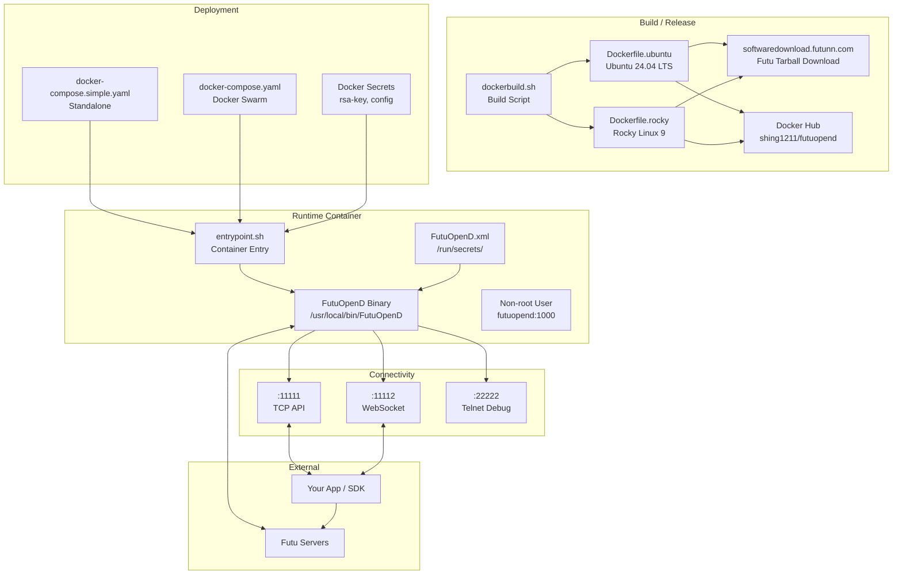

# FutuOpenD Docker — Architecture

> FutuOpenD in a container. Cloud VM, NAS, Raspberry Pi — anywhere Docker runs.

## Overview

FutuOpenD is the local gateway daemon for Futu's trading API. It translates SDK calls intoFutunet's proprietary binary protocol and handles all market data push and trade execution.

This project packages FutuOpenD into Docker containers so it can run on servers, cloud VMs, NAS devices, and ARM hardware (Raspberry Pi) without a desktop session or manual dependency management.

**Current version:** 10.5.6508

---

## Functional Areas

### 1. Container Image (Dockerfile.ubuntu / Dockerfile.rocky)

Multi-stage Docker builds for two base OS variants:
- **Ubuntu 24.04 LTS** — `Dockerfile.ubuntu` (default)
- **Rocky Linux 9** — `Dockerfile.rocky`

Each variant supports both `amd64` and `arm64` architectures. The build downloads the official Futu tarball from `softwaredownload.futunn.com`, installs it under `/usr/local/bin/`, and configures a non-root user (`futuopend:1000`) for security.

```
base-amd64 ──► build ──────────────────────────────────────► final-amd64
                    │ Download Futu_OpenD_<ver>_Ubuntu18.04.tar.gz   │
                    └──────────────────────────────────────────────┘
base-arm64 ──► build ──────────────────────────────────────► final-arm64
                    │ Download Futu_OpenD_<ver>_Ubuntu18.04.tar.gz   │
                    └──────────────────────────────────────────────┘
```

Key Dockerfile features:
- `ARG FUTU_OPEND_VER` — version baked in at build time
- `HEALTHCHECK --interval=30s --start-period=60s` — waits for auth before marking healthy
- `pgrep FutuOpenD` — no curl dependency
- CRLF auto-fix via `sed -i 's/\r$//'` for Windows shell compatibility

### 2. Build & Release (dockerbuild.sh / dockerbuild.bat)

Automated build + push script for Docker Hub (`shing1211/futuopend`).

| Tag | Description |
|-----|-------------|
| `latest` | Ubuntu amd64 (default) |
| `ubuntu-amd64`, `ubuntu-arm64` | Ubuntu variants |
| `rocky-amd64`, `rocky-arm64` | Rocky Linux variants |
| `:10.5.6508-*` | Versioned builds |

Usage:
```bash
./dockerbuild.sh all              # ubuntu + rocky, amd64 only
./dockerbuild.sh ubuntu           # ubuntu only
./dockerbuild.sh --multiarch      # ubuntu + rocky, both amd64 + arm64
./dockerbuild.sh --multiarch ubuntu linux/arm64  # arm64 only
```

### 3. Container Lifecycle (entrypoint.sh)

The container entry point. Responsibilities:

1. **Trap signals** — `SIGTERM`, `SIGINT`, `SIGHUP` for graceful shutdown
2. **Start** — launches `/usr/local/bin/FutuOpenD` in background, records PID
3. **Wait** — blocks on the process; if killed, `trap shutdown` fires
4. **Shutdown** — sends `TERM`, waits up to 30s for clean exit, escalates to `KILL`

```
SIGTERM/SIGINT/SIGHUP
        │
        ▼
   shutdown()
        │
    pgrep FutuOpenD
        │
   kill -TERM $PID ──► wait 30s ──► kill -9 $PID (if timeout)
```

### 4. Runtime Configuration (FutuOpenD.xml.template + FutuOpenD.xml)

Official FutuOpenD XML config template with `${ENV_VAR}` substitution support.

Key config sections:
- `login_account` / `login_pwd_md5` — account credentials
- `api_port` (default 11111) — TCP API listener
- `websocket_port` (default 11112) — WebSocket listener
- `telnet_port` (default 22222) — remote debug command port
- `rsa_private_key` — path to RSA private key for encrypted trading
- `pdt_protection` / `dtcall_confirmation` — US market regulatory features

### 5. Deployment (docker-compose.simple.yaml / docker-compose.yaml)

Two compose files for different environments:

| File | Use case | Secrets |
|-------|----------|---------|
| `docker-compose.simple.yaml` | Standalone dev/test | Bind-mounted `FutuOpenD.xml` file |
| `docker-compose.yaml` | Production (Docker Swarm) | Docker Secrets (`rsa-key`, `config`) |

Both expose:
- **11111/tcp** — FutuOpenD TCP API
- **11112/tcp** — FutuOpenD WebSocket

Volume mounts:
- `/run/secrets/FutuOpenD.xml` — config (read-only)
- `/home/futuopend/.com.futunn.FutuOpenD` — persistent data (quotes, logs)

---

## Key Execution Flows

### Flow 1: Docker Build

```
dockerbuild.sh all
    │
    ├── docker build -f Dockerfile.ubuntu --target final-amd64 ...
    │       │
    │       ├── Download Futu_OpenD_10.5.6508_Ubuntu18.04.tar.gz
    │       ├── tar -xzf → /tmp/Futu_OpenD_<ver>_Ubuntu18.04/
    │       └── COPY to /usr/local/bin/
    │
    ├── docker build -f Dockerfile.rocky --target final-amd64 ...
    │       │
    │       └── Download Futu_OpenD_10.5.6508_Centos7.tar.gz
    │
    ├── docker tag + push shing1211/futuopend:10.5.6508-ubuntu-amd64
    ├── docker tag + push shing1211/futuopend:10.5.6508-rocky-amd64
    └── docker tag + push shing1211/futuopend:latest
```

### Flow 2: Container Start

```
docker compose -f docker-compose.simple.yaml up -d
    │
    ├── Build (if not cached) ──► Dockerfile.ubuntu multi-stage
    │
    ├── Create volume futuopend-data
    │
    └── Start container futuopend
            │
            ├── Mount FutuOpenD.xml → /run/secrets/FutuOpenD.xml:ro
            │
            └── Execute entrypoint.sh
                    │
                    └── /usr/local/bin/FutuOpenD &
                            │
                            ├── FutuOpenD reads /run/secrets/FutuOpenD.xml
                            ├── Connects to Futu servers (HTTPS/WSS)
                            └── Opens: :11111 TCP  :11112 WS  :22222 Telnet
```

### Flow 3: SDK Call (incoming)

```
Your App (Python/Java/C# SDK)
        │
        │ connect("localhost", 11111)
        ▼
   FutuOpenD :11111 (TCP) or :11112 (WebSocket)
        │
        ├── Authenticate (RSA or password)
        │
        ├── Route to Futu backend (HTTPS/WSS)
        │
        └── Push market data / trade confirmations back via WebSocket
```

### Flow 4: Graceful Shutdown

```
docker stop futuopend
    │
    ├── SIGTERM → entrypoint.sh trap shutdown()
    │
    ├── kill -TERM $FutuOpenD_PID
    │
    ├── FutuOpenD closes listeners, flushes logs
    │
    └── Container exits cleanly
```

---

## Architecture Diagram



---

## Security Model

| Measure | Implementation |
|---------|----------------|
| Non-root user | `futuopend:1000` (UID 1000) |
| Secrets | Docker Secrets (Swarm) or bind-mounted files |
| TLS | WebSocket SSL via certificate + key config |
| Capabilities | `CAP_DROP_ALL` — container runs with minimal privileges |
| Filesystem | Read-only root + explicit volume mounts |
| RSA key | Path configured in `FutuOpenD.xml`, file mode 0400 |

---

## File Inventory

| File | Role |
|------|------|
| `Dockerfile.ubuntu` | Ubuntu 24.04 multi-stage build (amd64/arm64) |
| `Dockerfile.rocky` | Rocky Linux 9 multi-stage build (amd64/arm64) |
| `dockerbuild.sh` | Linux/macOS build + push script |
| `dockerbuild.bat` | Windows build script |
| `entrypoint.sh` | Container entry with graceful SIGTERM/SIGINT handling |
| `FutuOpenD.xml.template` | Official config with `${ENV_VAR}` substitution |
| `docker-compose.simple.yaml` | Standalone deployment |
| `docker-compose.yaml` | Docker Swarm production deployment |
| `.env.example` | Environment variable template |

---

*This project is an unofficial community packaging. Not affiliated with, endorsed by, or supported by Futu Securities or moomoo. All trademarks belong to their respective owners.*
